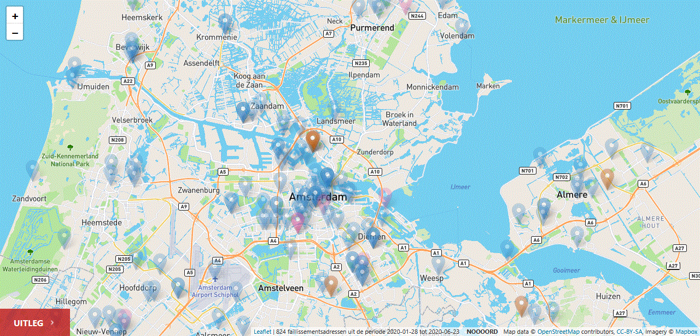
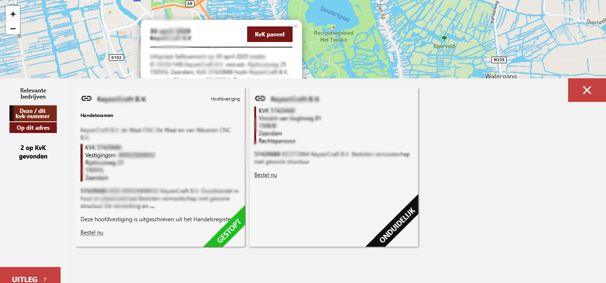

# faillissementen-scraper

maakt een kaart met faillissementen
Louter voor educatieve doeleinden - sla nooit gegevens op die een persoon kunnen identificeren.

Gebruik de escape knop als je een popup of paneel open hebt om die weer snel te sluiten.

## Dit is een prototype.

V1 is in ontwikkeling. Zie oa het [ontwerp voor de v1.](ontwerp-v1/TO.md)

## uitleg?

dev@sjerpbouwtsites.nl

## installeren zoals het er nu voorstaat.

[Zie de installatiegids](INSTALL.md)
